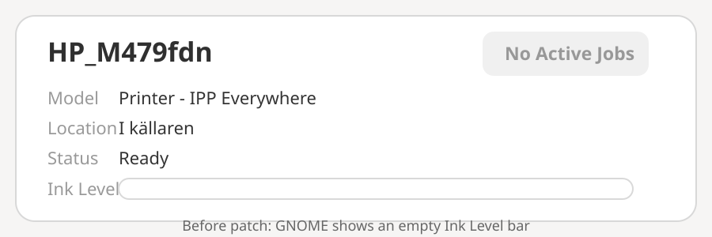
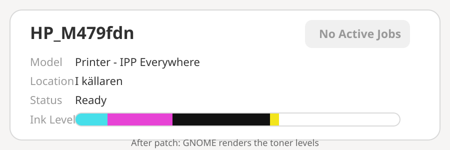

# GNOME Printer Ink/Toner Level Fix

A tested fix for **GNOME Control Center 48.4** where some IPP printers report valid toner levels through CUPS, but GNOME Settings does not display them.

Tested with Debian 13 (Trixie), `gnome-control-center` `1:48.4-1~deb13u1`, and an HP Color LaserJet Pro MFP M479fdn using IPP Everywhere.

## Before and after

### Before patch

GNOME Settings showed the printer as ready, but the `Ink Level` bar was empty even though CUPS had valid toner data.



### After patch

After adding support for the hyphenated marker types and restarting GNOME Control Center, the same IPP Everywhere queue displayed toner levels.



> The SVGs above are focused visual reproductions of the GNOME printer card states captured during testing, so the important before/after difference is easy to see in the repository.

## Symptom

Printing worked normally and CUPS already reported valid supply data:

```text
marker-levels=60,10,30,60
marker-types=toner-cartridge,toner-cartridge,toner-cartridge,toner-cartridge
```

`system-config-printer` displayed all four toner levels correctly, while **GNOME Settings → Printers** showed an empty `Ink Level` row.

## Root cause

GNOME Control Center 48.4 filters marker entries in `panels/printers/pp-printer-entry.c`.

It accepted:

```text
ink
toner
inkCartridge
tonerCartridge
```

but the tested printer reported:

```text
toner-cartridge
```

GNOME therefore discarded otherwise valid marker data.

## Fix

The fix extends the existing condition so it also accepts:

```text
ink-cartridge
toner-cartridge
```

See the exact patch:

- [`patches/gnome-control-center-48.4-hyphenated-marker-types.patch`](patches/gnome-control-center-48.4-hyphenated-marker-types.patch)

For the complete Debian 13 build and installation procedure:

- [`BUILD-DEBIAN-TRIXIE.md`](BUILD-DEBIAN-TRIXIE.md)

## Verified result

After rebuilding and installing the patched GNOME Control Center, the normal GNOME printer panel displayed the toner bar for the existing IPP Everywhere queue.

The displayed levels matched CUPS:

```text
Black    60%
Cyan     10%
Magenta  30%
Yellow   60%
```

No HPLIP queue was required.

## Scope

This is a local, tested workaround, not an official GNOME or Debian package. The source change is architecture-independent and only changes marker-type matching in GNOME Control Center. A later GNOME release may already contain an equivalent fix, so check current source before applying it elsewhere.
